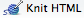
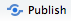
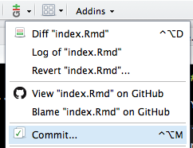
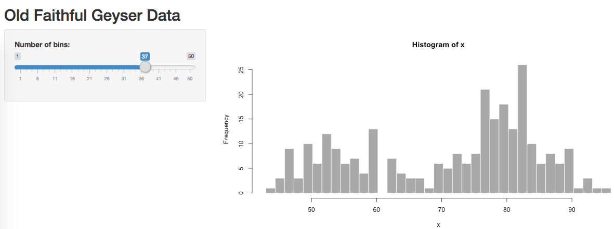
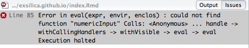

********
# Public Transit Map
Work in progress  
*2017/12/17*

Check out [this great public transit map](https://shiny.rstudio.com/gallery/bus-dashboard.html). Are you thinking "Man, I sure wish we had that in my town"? I know I am.  

Putting my work in progress goals up here to keep myself accountable. Stay tuned!

********

# Exploratory Text Analysis
Workshop by [Sarah Stanley](https://twitter.com/sarcathtic) and Carolyn Moritz  
*2017/04/14*

**Text analysis** covers any method that treats text as data, sorting and analyzing it for research. The more specific **text mining** deals with natural language text, such as that found in books, articles, and so forth.  

## Getting Started

Today we are going to apply exploratory text mining practices to [The Complete* Works of William Shakespeare](http://www.gutenberg.org/cache/epub/100/pg100.txt) courtesy of Project Gutenberg. 
All of the necessary materials are in my GitHub repository [datalitfsu3](https://github.com/exsilica/datalitfsu3).  

\* After creating our own shortened version of this text to include only Shakespeare's plays, our analysis uncovered that the corpus includes only 36, not 38 plays. So it is not actually "complete," but props to Project Gutenberg for trying.

*The workshop begins with an introduction to the RStudio environment and a beginner-friendly warm up session. As the anticipated audience for this blog is already familiar with R and RStudio basics, I am not including it here. You can follow along by downloading and running [startup.R](https://github.com/exsilica/datalitfsu3/blob/master/startup.R) in your RStudio console.*  

We familiarize ourselves with the `stringr` library by running a quick exercise based off of Selva Prabhakaran's [Introduction to R Programming](https://www.udemy.com/learning-path-r-programming).   

## Text preparation

**Text preparation** can take up a significant portion of text mining activities. This involves preparing the text data so that it only includes the information valuable to us. In this case, that means stripping out the Project Gutenberg licensing metadata, and then using specialized tools to parse the text data out of the XML framework.  

Some notes about text preparation:  

* For pedagogical purposes, it makes sense for us to integrate our text prep into the workshop code. Many researchers, however, prefer third party text preparation sources such as [OpenRefine](http://openrefine.org/) for spreadsheets or [Oxygen](https://www.oxygenxml.com/) for XML. As you venture further into text analysis, try different options to develop a workflow you find comfortable.
* [Katie Rawson](http://twitter.com/katie_rawsom) and [Trevor Muñoz](http://twitter.com/trevormunoz) wrote an intriguing piece called [Against Cleaning](http://curatingmenus.org/articles/against-cleaning/) that challenges traditional notions of "unclean/messy" data and asks the researcher to consider what realities are being lost when we compulsively "clean" our raw data without first conducting a critical analysis. It is a worthwhile read for anybody who works with data in the humanities and social sciences.  

## Parsing XML Text

Now that we are comfortable with the concept of text manipulation, Sarah will take over and show us how to use R to parse XML text data.  

We first follow Sarah in [shakespeare_xml.R](https://github.com/exsilica/datalitfsu3/blob/master/shakespeare_xml.R). Calling `library(XML)` and `library(tm)`, we instantiate the XML parsing and text mining packages that will provide us with specific tools for what we want to do here. We first use pattern matching to identify all .xml files in the directory and write them to a vector called `files.v`. Now we can use `xmlTreeParse` and `xpathSApply` to identify our desired XPath and migrate its internal content into a content-only list. For those unfamiliar with XML, the **XPath** is the specific path in a nested XML document that points to our content. In this case, as we are dealing with XML composed with the [TEI](http://tei-c.org/) language, the XPath looks like this:  

`"/tei:TEI//tei:sp/tei:l/text() | /tei:TEI//tei:sp/tei:ab/text() | /tei:TEI//tei:sp/tei:p/text()"`  

The piping in this case tells the `xpathSApply` function to find all content nested under `tei:l`, `tei:ab`, and `tei:p`. This gives us lines, abstract data, and paragraphs.  

Sarah's text prep has 4 goals:  
1. Remove metadata  
2. Define a start and end point for the entire corpus  
3. Separate each play into individual units  
4. Create a vector list for each play containing its individual words  

## Word Frequencies

Sarah can now call *The Merchant of Venice* and separate its text into a vector of individual words. To illustrate some of the further preparation an analyst might wish to undertake, Sarah first creates a new vector `antonios.v` containing all instances of the word "Antonio" and runs `length(antonios.v)` to see how frequently it appears. Wow, Antonio appears quite a bit! Do the characters in The Merchant of Venice discuss Antonio all the time? Probably not. Plays include speaker tags: an indication that a particular character is about to speak next. You have likely seen it:  

ANTONIO: Mark you this, Bassanio, / 
The devil can cite Scripture for his purpose...  

It is highly likely that the high occurrence of "Antonio" includes these speaker tags; if we remove them, we can more closely analyze how many times Antonio is actually mentioned by the play's characters.

Returning to our prepared text, Sarah runs a **word frequency table** of the entire play, configuring her table to return the top 10 most frequent words.  

## Narrative Time

Follow along with [shakespeare_plaintext.R](https://github.com/exsilica/datalitfsu3/blob/master/shakespeare_plaintext.R).

Now that we can individually move between plays, Sarah chooses *The Merchant of Venice* for a session on Narrative Time. Unlike chronological time, which takes a linear progression between a single starting and ending point, **narrative time** covers the temporal telling of events from a number of different dimensions. This might include a comparative analysis between [story time and discourse time](http://www2.anglistik.uni-freiburg.de/intranet/englishbasics/Time02.htm), or, as in Sarah's case, assessing particular scenes in a play. Now we can run another word frequency table to compare how frequently certain words (Antonio, perhaps) occur in different scenes.  

## Topic Modeling

You are probably beginning to form an idea in your mind of the sorts of analyses you could make about a corpus with operations such as word frequencies. More sophisticated techniques build upon these more basic functions; one of these is called **topic modeling**. Here I take over with [topicmodel.R](https://github.com/exsilica/datalitfsu3/blob/master/topicmodel.R).  

By separating a text into a vector of disparate, unconnected words, we can model the several themes and topics an author covers in any given work.  

We start by segmenting the text into "chunks" of 1000 words each. The function runs an additional check to add the final chunk of text to the previous one if it is under 500 words, or add it to a new segment if it is 500 words or greater.

I am currently working on a comparative topic model between the different plays in Shakespeare's corpus. For the purposes of this shorter workshop, however, we will use the XMLAuthorCorpus folder provided by Matthew Jockers, author of [Text Analysis for Students of Literature](www.matthewjockers.net/text-analysis-with-r-for-students-of-literature/).  

Once again, we create our `files.v` vector and fill it with each .xml file in the corpus folder, and then grab the file names without the extension to hold in a variable named `textname`. We do another round of text preparation to prepare our data for a topic model, converting it into a data frame with two columns.  

**Some helpful language:**  
1. **List:** 1-dimensional, homogenous (only carries one data type)  
2. **Matrix:** 2-dimensional, homogenous  
3. **Vector:** 1-dimensional, heterogenous (carries multiple data types)  
4. **Data Frame:** 2-dimensional, heterogenous  

So, our resulting data frame carries one column called `"id"` made up of all of those individual file names we grabbed in `textname`, and another column called `"text"` holding each file's associated text. This sorting is a best practice for usability purposes: the resulting model will not be very meaningful to us if we do not create a column with individual titles to describe each story's results.  

We now install the `mallet` package, which runs on `rJava` to make powerful operations. `rJava` allows for us to interface with the Java programming language through R, and has a number of interesting applications. We can run `getVocabulary` to see a full list of the resulting vocabulary - that is, the separate words from our corpus. We use this vocabulary list to set column names - again, to make the results intelligible to us - and pull some example keywords, "california" and "ireland" for a preliminary assessment.  

Finally, we can visualize our results with the `wordcloud` library. Wordclouds, like all plots in R, have a variety of configuration settings to adjust the aesthetic options.


********

# Early English Books Online
Blog post by [Sarah Stanley](https://twitter.com/sarcathtic)  
*2017/04/04*

My colleague and fellow RHuman Sarah posted [a comprehensive real-world example](https://fsulib.wordpress.com/2017/04/04/r-early-english-books-online/) of using R to analyze a corpus of text from Early English Books Online (EEBO). This is a preview of the sort of work we will cover in our April 14 workshop using Shakespeare plays, so check it out!

********

# Playing with Shiny Apps
Shop talk  
*2017/03/22*

After much trial and error, I finally have embedded interactive apps on the site! I am posting the solution first for those who are less interested in the tales of my unsuccessful attempts, but more details can be found under the demo Old Faithful app in the **Breadcrumbs** section.

### Solution

Several other commenters on an [Embedded Shiny Apps](http://rmarkdown.rstudio.com/authoring_embedded_shiny.html) article described having the same problems I was with the `shinyAppDir()` embed approach. User [Liang C. Zhang](https://disqus.com/by/liangchengzhang/) recommended linking to shinyapps.io via iframe with regular HTML. I am happy to say this was successful, although I will add that I personally consider it a workaround, not a solution. I will continue to play around with `shinyAppDir()` and see what I learn. In the meantime, however, the iframe approach allows me to move forward with using this website for interactive applications.

<iframe src="https://exsilica.shinyapps.io/newshinyapp" style="border: none; width: 700px; height: 700px"></iframe>

### Breadcrumbs

Last Percolator session, I realized my best path forward was to create a [shinyapps.io](https://shinyapps.io) account to host my web applications. Although I have come across a few alternatives, including [RStudio Server](https://www.rstudio.com/products/rstudio/download-server/), the ability to quickly publish Shiny apps from RStudio to the web was in line with what I am already trying to do with Github Pages.  

R provides a demo version of virtually every feature it offers, making it really easy to quickly start testing with prefabricated code and data. I wanted to try two things: use inline code to embed a quick Shiny app, and refer to my newly-hosted shinyapps.io content as an external directory. For the first, I used the **cars** app referenced in the Percolator session under **Shiny Web Apps**. I attempted both `rsconnect::deployApp()` and `ShinyAppDir()` for internal embedding, with a few different syntax formats for the directory path. I had been certain the problem was in how I was entering the directory path until stumbling upon the aforementioned Embedded Shiny Apps comment thread and discovering many others have experienced the same difficulties as myself. It is possible that may still be the problem - I am accustomed to working in my local directory, and the app I am trying to deploy is being knit to an HTML document hosted online.  

This is becoming my de facto motto: "Further experimentation needed!"

********

# Intro to RMarkdown
Percolator session by Carolyn Moritz  
*2017/03/01*

**Percolator**: Open office hours here at the [Office of Digital Research & Scholarship](https://www.lib.fsu.edu/drs), located in the Scholars Commons of the FSU Strozier Library. We percolate on Wednesdays from 3:00 - 5:00pm EST, and while everybody is free to come consult, play, or just hang out, sometimes we theme our sessions. I have been a fan of the R language for three years now, but only just discovered RMarkdown last Friday and put up this website on Monday. I am eager to explore possible next steps, so this week's Percolator is in RMarkdown's honor! Here to join me are [Sarah Stanley](https://twitter.com/sarcathtic) and [Nicole Strayhorn](https://twitter.com/NickyStray), with occasional visits and jokes from [Bryan Brown](https://twitter.com/bryjbrown).  

### Initial Setup
To follow along on your own machine, first install [R](https://cran.r-project.org/) and [RStudio](https://www.rstudio.com/products/rstudio/).  
In the RStudio console, install the RMarkdown package and call the library: 
<br><br>
`install.packages("rmarkdown")`  
`library(rmarkdown)`  

**Reference Links**  
[Get Started](http://rmarkdown.rstudio.com/lesson-1.html)  
[RMarkdown Reference Guide](https://www.rstudio.com/wp-content/uploads/2015/03/rmarkdown-reference.pdf)  
[RMarkdown Cheatsheet](https://www.rstudio.com/wp-content/uploads/2016/03/rmarkdown-cheatsheet-2.0.pdf)  
[Gallery](http://rmarkdown.rstudio.com/gallery.html)  

The following section is a handy reference provided by RStudio. To create it as an independent RMarkdown document: **File** -> **New File** -> **R Markdown...**  

```{r setup, include=FALSE}
knitr::opts_chunk$set(echo = TRUE)
```

### RMarkdown

This is an RMarkdown document. Markdown is a simple formatting syntax for authoring HTML, PDF, and MS Word documents. For more details on using R Markdown see <http://rmarkdown.rstudio.com>.  

When you click the **Knit** button a document will be generated that includes both content as well as the output of any embedded R code chunks within the document. You can embed an R code chunk like this:  

```{r cars}
summary(cars)
```

### Including Plots

You can also embed plots, for example:  

```{r pressure, echo=FALSE}
plot(pressure)
```

Note that the `echo = FALSE` parameter was added to the code chunk to prevent printing of the R code that generated the plot.  

### Demonstration: Pushing to Site

Participants curious about this website setup are encouraged to visit [Like this setup?](setup.html) for notes on the resources I used.  

Pushing new content to the live site consists of three steps: **Knit**, **Commit**, and **Push**.  

Selecting **Knit HTML**   in the console opens a live preview window. If I had an RPub account synced to this console, I could select **Publish**  and automatically send the generated HTML document to an RPub website. My configuration, however, requires two quick additional steps.  

We **commit** changes in the Version Control dropdown menu:      
  

The left pane displays files that have been changed. Now we select **Staged** for all of them and add a useful commit message. We select **Commit**, close the confirmation window, and finally push the content to the site with **Push**.  

    

Interesting to note: Occasionally, the commit will fail the first time, but succeed on a second attempt. Cursory reserach reveals that this is not an uncommon issue, but I have not yet uncovered the reason. As it does not occur in my home, it may possibly have to do with FSU's campus firewalls.  

We can quickly browse the available references (see **Reference Links** in the **Initial Setup** section) to get an idea of what RMarkdown can do. A significant note here is that, while this is an HTML website, RMarkdown has several other output formats available including presentations, word processing and PDF documents, notebooks, and [interactive content](http://rmarkdown.rstudio.com/lesson-14.html). This last output is what I want to explore in today's Percolator session.  


### Shiny Web Apps

Adding `runtime: shiny` to the YAML head (which is actually [not the same Pandoc markdown language we are using in the rest of the document](http://push.cwcon.org/learn/yaml-and-markdown.html)) allows us to call Shiny code right in the document. Once we do so, we can see that the **Knit HTML** option has changed to **Run Document** .  

We first open a standalone Shiny app in RStudio to get an idea of how it behaves: **File** -> **New File** -> **Shiny Web App...** We select **Run App**  to run the auto-generated web application the sample text provides, which opens in an interactive preview window:    

  

Now we're playing! It's time to call some Shiny code into RMarkdown. I take the sample code from the [RMarkdown Cheatsheet](https://www.rstudio.com/wp-content/uploads/2016/03/rmarkdown-cheatsheet-2.0.pdf) and pop it into our newly-minted **Shiny Web Apps** section.  

`{r, echo = FALSE}`  
`numericInput("n",`  
` "How many cars?", 5)`  
`renderTable({`  
` head(cars, input$n)`  
`})`  
  

We can play around with the **cars** app in the preview window, but here we run into publishing issues. Because **Run Document** has completely replaced the option to knit an HTML document, we cannot publish this to the site. Returning to our reference documents, we see that Shiny apps are server-side and, as browsers do not read R code, only run in an active R session. I take `runtime: shiny` out of the head so that I can knit the final results, supposing that the browser version will display a static screenshot. Instead RStudio calls an error: without `runtime: shiny`, it cannot call the code at all:  

  

I've instead changed the app markup to unexcuted code (what you see above) to display what we tried to run. It appears the best solution is to create a [shinyapps.io](http://shinyapps.io) account to publish my web apps, and link to them from there. I'll set that up in the following week, and in next week's session we can focus on navigating shinyapps.io as well as client-side **htmlwidgets**.  

Thank you Sarah, Nicole, and Bryan for a fun and informative exploratory session!  

********

# R & RStudio Setup

I made a [Research Guide](http://guides.lib.fsu.edu/text-analysis/r) covering installation, setup, the RStudio environment, and some quick tips. I will continue to update it based on the type of questions we get.